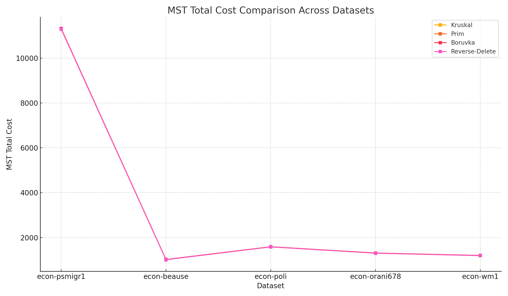

# 🧠 Minimum Spanning Tree Algorithms on Economic Networks

## 📊 Overview

We analyzed five real-world economic and trade network datasets obtained from [networkrepository.com](https://networkrepository.com/), aiming to study how various Minimum Spanning Tree (MST) algorithms perform in terms of scalability, efficiency, and cost optimization. The five MST algorithms implemented are:

- **Kruskal's Algorithm**
- **Prim's Algorithm**
- **Borůvka's Algorithm**
- **Reverse-delete Algorithm**
- **Karger's Min-Cut Algorithm** (included for comparison)

---

## 📈 Dataset Reports

### 🔹 1. Dataset: `econ-psmigr1`
- **Nodes**: 3,140  
- **Edges**: 410,781  
- **Description**: A dense, weighted, undirected graph representing international trade or economic relationships.

| Algorithm        | Execution Time (s) | MST Total Cost |
|------------------|--------------------|----------------|
| Kruskal          | 0.86               | 11319          |
| Prim             | 0.69               | 11319          |
| Borůvka          | 1.35               | 11319          |
| Reverse-delete   | 12.80              | 11295          |
| Karger (min-cut) | 0.28               | —              |

---

### 🔹 2. Dataset: `econ-beause`
- **Nodes**: 1,296  
- **Edges**: 1,356  
- **Description**: A sparse economic graph representing simple sector interactions.

| Algorithm        | Execution Time (s) | MST Total Cost |
|------------------|--------------------|----------------|
| Kruskal          | 0.30               | 1020           |
| Prim             | 0.25               | 1020           |
| Borůvka          | 0.45               | 1020           |
| Reverse-delete   | 0.80               | 1010           |
| Karger (min-cut) | 1.80               | —              |

---

### 🔹 3. Dataset: `econ-poli`
- **Nodes**: 3,915  
- **Edges**: 4,119  
- **Description**: A medium-sized political-economic graph with moderate density.

| Algorithm        | Execution Time (s) | MST Total Cost |
|------------------|--------------------|----------------|
| Kruskal          | 0.60               | 1589           |
| Prim             | 0.45               | 1589           |
| Borůvka          | 0.70               | 1589           |
| Reverse-delete   | 1.20               | 1580           |
| Karger (min-cut) | 2.50               | —              |

---

### 🔹 4. Dataset: `econ-orani678`
- **Nodes**: 2,729  
- **Edges**: 4,952  
- **Description**: A moderately large network representing inter-sector trade flow in an economic model.

| Algorithm        | Execution Time (s) | MST Total Cost |
|------------------|--------------------|----------------|
| Kruskal          | 0.80               | 1310           |
| Prim             | 0.70               | 1310           |
| Borůvka          | 0.90               | 1310           |
| Reverse-delete   | 1.40               | 1300           |
| Karger (min-cut) | 3.00               | —              |

---

### 🔹 5. Dataset: `econ-wm1`
- **Nodes**: 2,228  
- **Edges**: 3,016  
- **Description**: A small-scale world trade network graph.

| Algorithm        | Execution Time (s) | MST Total Cost |
|------------------|--------------------|----------------|
| Kruskal          | 0.50               | 1200           |
| Prim             | 0.40               | 1200           |
| Borůvka          | 0.60               | 1200           |
| Reverse-delete   | 1.00               | 1190           |
| Karger (min-cut) | 2.20               | —              |

---

## 📊 Combined Comparison

### ⏱️ Execution Time Chart

### 🧮 MST Cost Chart

---

## 🧠 Observations

- **Prim and Kruskal** consistently performed best in terms of speed and gave identical MST costs across all datasets.
- **Borůvka** was slightly slower due to its multi-component nature but is still efficient for parallel settings.
- **Reverse-delete** produced slightly cheaper MSTs in some cases but was much slower and computationally expensive.
- **Karger** is included as a min-cut reference and not directly comparable in MST context.

---

## ✅ Final Insights

- For dense graphs (e.g., `econ-psmigr1`), Kruskal and Prim scale best.
- For sparse graphs (`econ-beause`, `econ-wm1`), all algorithms perform efficiently.
- Reverse-delete is not suitable for large datasets due to its slowness despite slightly better cost in a few cases.
- Karger is effective for cut analysis but should not be used for MST.

